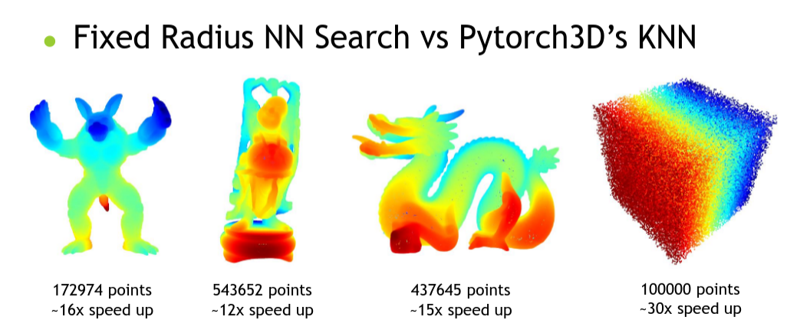

# FRNN

A Fixed Radius Nearest Neighbors Search implemented on CUDA with similar interface as [pytorch3d.ops.knn_points](https://pytorch3d.readthedocs.io/en/latest/modules/ops.html#pytorch3d.ops.knn_points).

## Performance



## Algorithm Walkthrough & Experiment Results

[FRNN Presentation](./frnn_pre.pdf)

## Depenency

Tested with cuda 10.2, python 3.8 and pytorch 1.6.0 on ubuntu 18.04.

Should be also fine other versions of cuda/python/pytorch.

## Install

```
git clone --recursive https://github.com/lxxue/FRNN.git
# install a prefix_sum routine first
cd FRNN/external/prefix_sum
pip install .

# install FRNN
cd ../../ # back to the {FRNN} directory
# this might take a while since I instantiate all combinations of D and K
pip install .
```

## Usage

For fixed nearest neighbors search:
[doc](https://github.com/lxxue/FRNN/blob/59a4c8fdc786c64afd991919af39f1a65d4ec2ff/frnn/frnn.py#L154-L224)

```
  # first time there is no cached grid
  dists, idxs, nn, grid = frnn.frnn_grid_points(
        points1, points2, lengths1, lengths2, K, r, grid=None, return_nn=False, return_sorted=True
  )
  # if points2 and r don't change, we can reuse the grid
  dists, idxs, nn, grid = frnn.frnn_grid_points(
        points1, points2, lengths1, lengths2, K, r, grid=grid, return_nn=False, return_sorted=True
  )
```

For manually gather nearest neighbors from idxs generated via frnn_grid_points:
[doc](https://github.com/lxxue/FRNN/blob/59a4c8fdc786c64afd991919af39f1a65d4ec2ff/frnn/frnn.py#L268-L292)

```
  nn = frnn.frnn_gather(points2, idxs, lengths2)
```

## Note

For small point clouds (e.g. < 10,000 points), the bruteforce way (e.g. pytorch3d's KNN) might be faster.

## TODO

- [x] support large D (not fully optimized yet)
- [x] support large K (not fully optimized yet)
- [ ] try use z-order for the grid cell indices
- [ ] speedup and interface for the same query and reference point cloud
- [ ] collect all points within radius
- [ ] cpp standalone implementation

If you want a new feature, just open an issue or send me an email about it.

## Acknowledgement

The code is build on the [algorithm](https://on-demand.gputechconf.com/gtc/2014/presentations/S4117-fast-fixed-radius-nearest-neighbor-gpu.pdf) introduced by Rama C. Hoetzlein. I use the [parallel prefix_sum](https://github.com/lxxue/prefix_sum) routines implemented by [mattdean1](https://github.com/mattdean1/cuda). I also learn (copy & paste) a lot from [Pytorch3D's KNN](https://github.com/facebookresearch/pytorch3d/blob/master/pytorch3d/csrc/knn/knn.cu) implementations.

<!--
## TODO

1. Fix the problem of error for long thin objects
2. Support dimensions for arbitrary D
3. Support K > 32
4. KNN grid implementations
-->
